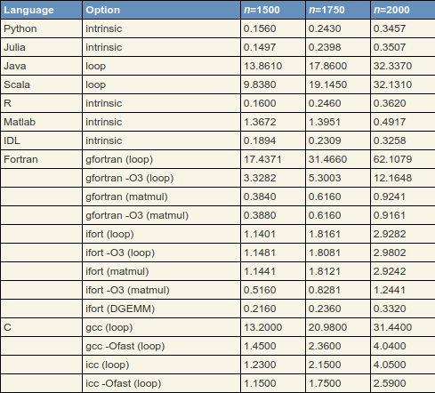

<!-- TOC -->

- [Giriş](#giriş)
- [Neden Julia?](#neden-julia)
- [Julia'yı Yükleme](#juliayı-yükleme)
- [Bazı Faydalı Kaynaklar](#bazı-faydalı-kaynaklar)
- [Alıştırmalar](#alıştırmalar)
    - [Hello World](#hello-world)
    - [Ekrana Tek Sayıları Yazdırma](#ekrana-tek-sayıları-yazdırma)
    - [Kullanıcının Verdiği Yarıçap İle Kürenin Hacmini Hesaplayan Fonksiyon Yazma](#kullanıcının-verdiği-yarıçap-i̇le-kürenin-hacmini-hesaplayan-fonksiyon-yazma)
    - [Julia'da Modül Yazma](#juliada-modül-yazma)

<!-- /TOC -->

# Giriş
* Tüm materyal bir süre boyunca aşağıdaki linktedir

[https://github.com/bulmust/julia_FH_Ders](https://github.com/bulmust/julia_FH_Ders)

* Bu derste, Julia dilinin yanında Linux komutları kullanılacaktır. (Mac için de uygun olabilir). Linux komutları daha çok dosya oluşturma vs. gibi komutlar olacağı için Windows kullanıcıları da kolaylıkla dersi takip edebilir.

* Github'da bulunan materyeli aşağıdaki komutu terminale yazarak indirebilirsiniz.

`git clone https://github.com/bulmust/julia_FH_Ders`

Bu ders sırasında yapılacakları aşağıdaki gibi özetleyebiliriz.
1. Julia Program Dili ile diferansiyel denklem çözümü ve diğer dillerle karşılaştırılması
1. Julia Program Dilinin yüklenmesi
1. Julia Program Dili kullanılarak temel alıştırmaların yapılması
1. Paket programlarının yüklenmesi
1. Bazı diferansiyel denklemlerin çözülmesi

---------------
# Neden Julia?
- "Julia is a high-level, high-performance, dynamic programming language. While it is a general purpose language and can be used to write any application, many of its features are well-suited for numerical analysis and computational science." [Wiki](https://en.wikipedia.org/wiki/Julia_(programming_language))

  - Implementation language	Julia, C, C++, Scheme, LLVM

  - First appeared	2012

- Çeşitli program dillerinin karşılaştırılması hakkında güzel bir yorumu [şu linkte](https://www.stochasticlifestyle.com/comparison-differential-equation-solver-suites-matlab-r-julia-python-c-fortran/) bulabilirsiniz.

- Çeşitli programlama dillerinin arasındaki hızların karşılaştırılmıştır (2019). Daha ayrıntılı ve yorumlu karşılaştırma için [tıklayınız.](https://modelingguru.nasa.gov/docs/DOC-2783)

Python, Julia, Java, Scala, IDL, Matlab, R, C, Fortran

**Matrix Çarpımı**



**Diğerleri**


- Aşağıdaki program dillerinde yazılmış diferansiyel denklem çözücüler karşılaştırılmıştır. Daha ayrıntılı ve yorumlu karşılaştırma için [tıklayınız](https://www.stochasticlifestyle.com/comparison-differential-equation-solver-suites-matlab-r-julia-python-c-fortran/). 

MATLAB, Scipy (Python), deSolve (R), DifferentialEquations.jl (Julia), Sundials (C++ ve Fortran), Hacker (Fortran), ODEPACK/Netlib/NAG (Fortran), JitCode(Python), PYDSTool (Python), FATODE (Fortran), GSL(C), BOOST (C++), Mathematica, Maple


Not: Iphone diferansiyel denklem çözücü. [Fluxura](https://apps.apple.com/in/app/fluxura/id1525196129): 


# Julia'yı Yükleme

- Github Linki: [https://github.com/JuliaLang/julia](https://github.com/JuliaLang/julia)

- Dosyanın bulunduğu Link: [https://julialang.org/downloads/](https://julialang.org/downloads/)

- Windows: 64-bit (installer) ~ 65 MB

**Linux:**

- Ubuntu (Eski Surum):
`sudo apt install julia`
  
- Ubuntu (En Yeni Sürüm, 1.5.1, 10.09.2020)

```bash
 #wget https://julialang-s3.julialang.org/bin/linux/x64/1.5/julia-1.5.1-linux-x86_64.tar.gz
 #tar -xvf julia-1.5.1-linux-x86_64.tar.gz
 #sudo mv julia-1.5.1/ /opt/
 #sudo ln -s /opt/julia-1.5.1/bin/julia/ /usr/local/bin/
 
 wget https://julialang-s3.julialang.org/bin/linux/x64/1.5/julia-1.5.2-linux-x86_64.tar.gz
 tar -xvf julia-1.5.2-linux-x86_64.tar.gz
 sudo mv julia-1.5.2/ /opt/
 sudo ln -s /opt/julia-1.5.2/bin/julia/ /usr/local/bin/
```

- Arch Linux:

```bash
sudo pacman -S base-devel git
git clone https://aur.archlinux.org/julia-bin.git
cd julia-bin
makepkg -si
```

# Bazı Faydalı Kaynaklar

- Çevrimiçi Julia kodu çalıştırıcısı:

[https://julialang.org/learning/code-examples/](https://julialang.org/learning/code-examples/)

- Matematiksel işlemler ve tanımları: 

[https://docs.julialang.org/en/v1/base/math/](https://docs.julialang.org/en/v1/base/math/)

- Diğer dillerden farkları:

[https://docs.julialang.org/en/v1/manual/noteworthy-differences/](https://docs.julialang.org/en/v1/manual/noteworthy-differences/)

- Astronomi branşında kullanılan Julia paketleri:

[https://juliaastro.github.io/dev/index.html](https://juliaastro.github.io/dev/index.html)

# Alıştırmalar

- Yeni bir klasör oluşturun. 

```bash
cd; mkdir JuliaAlistirma; cd JuliaAlistirma
```

## Hello World

- "helloWorld.jl" adlı bir dosya oluşturun ve içerisine `println("Hello World")` yazın. 

```bash
touch helloWorld.jl
echo 'println("Hello World")' >> helloWorld.jl
nano helloWorld.jl
```

Kaydet ve çıkın. (Nano programından çıkmak için ctrl+x'e basın.)
- Terminale `julia` yazın.

```bash

               _
   _       _ _(_)_     |  Documentation: https://docs.julialang.org
  (_)     | (_) (_)    |
   _ _   _| |_  __ _   |  Type "?" for help, "]?" for Pkg help.
  | | | | | | |/ _` |  |
  | | |_| | | | (_| |  |  Version 1.5.2 (2020-09-23)
 _/ |\__'_|_|_|\__'_|  |  Official https://julialang.org/ release
|__/                   |

julia>
```

- Derlenmiş Julia programına giriş yaptınız. Bu arayüzde programınızı çalıştırabilirsiniz. Önce hangi klasörün içinde olduğumuza bakalım.

```julia
julia> pwd()
"/home/taygun/JuliaAlistirma"
```

- Klasörün içerisinde hangi dosyalar var ona bakalım. Ayrintili bilgi için [şu bağlantıya](https://docs.julialang.org/en/v1/base/file/) tıklayınız.

```julia
julia> klasorIci = readdir()
1-element Array{String,1}:
 "helloWorld.jl"

julia> klasorIci[1]
"helloWorld.jl"
```

- Oluşturduğmuz dosyayı iki şekilde çalıştırabiliriz. Birincisi, julia arayüzünün içinde oluşturduğumuz dosyayı çağıralım.

```julia
julia> include("helloWorld.jl")
Hello World
```

- Terminalden program çalıştırmak için aşağıdaki komutu çalıştırın. Bunun için julia arayüzünden çıkmak gerekmektedir.

```julia
julia> exit()
```

- Terminale aşağıdaki komutu yazın ve çalıştırın.

```bash
julia helloWorld.jl
```

## Ekrana Tek Sayıları Yazdırma

- tekSayiYazdir.jl dosyasını oluşturun.

```bash
touch tekSayiYazdir.jl
```

- Aşağıdaki kodu "tekSayiYazdir.jl" dosyasının içine yazın.

```julia
for i = 1:10
  if isodd(i)
    println(i)
  end
end
```

- Terminalde `julia tekSayiYazdir.jl` kodunu çalıştırın.

## Kullanıcının Verdiği Yarıçap İle Kürenin Hacmini Hesaplayan Fonksiyon Yazma

- kureHacmiBul.jl dosyasını oluşturun.

```bash
touch kureHacmiBul.jl
```

- Aşağıdaki kodu "kureHacmiBul.jl" dosyasının içine yazın.

```julia
function kure_hacmi_hesapla(r)
    # Julia'da Yorum Boyle Yazilir
    return 4/3*pi*r^3
end

# Kullanicidan Sayi Isteme Notunu Yazdirin
println("Lutfen Kurenin Yaricapini [cm] Girip Entera Basiniz")

# Kullanicin yazdigini okutun
r = readline()

# Kullanicinin Yazdigini integer (tam sayiya) cevirin
r = parse(Int64, r)

println("Kurenin Hacmi: ", kure_hacmi_hesapla(r), " cm^3")
```

- Terminale aşağıdaki komutu yazın ve çalıştırın.

```bash
julia kureHacmiBul.jl
```

## Julia'da Modül Yazma

- Modül dökümantasyonu [şu linktedir.](https://docs.julialang.org/en/v1/manual/modules/)

- "denemeModul.jl" dosyasını oluşturun.

```bash
touch denemeModul.jl
```

- "denemeModul.jl" dosyasına aşağıdaki kodu yazın.

```julia
module denemeModul
function deneme_modulu(x)
    println("Bu deneme moduludur.")
    return x
end

end
```

- Deneme modülünü çalıştıracak "denemeModulCalistir.jl" dosyasını oluşturun.

```bash
touch denemeModulCalistir.jl
```

- "denemeModulCalistir.jl" dosyasına aşağıdaki kodu yazın.

```julia
# Hamiltonyenler modulunu cagir.
include("./denemeModul.jl")

denemeModul.deneme_modulu(1)
```

- Terminalde "denemeModulCalistir.jl" dosyasını çalıştırın.

```bash
julia denemeModulCalistir.jl
```

- "denemeModul.jl" içerisindeki fonksiyonu julia arayüzünde çağıralım. Bunun için julia arayüzünü terminalde açın.

- Klasörün içinde hangi dosyalar olduğuna bakın.

```julia
klasorIci=readdir()
4-element Array{String,1}:
 "denemeModul.jl"
 "denemeModulCalistir.jl"
 "helloWorld.jl"
 "kureHacmiBul.jl
```

- Deneme modülü "denemeModulCalistir.jl" dosyasını arayüze çağırın.

```julia
julia> include(klasorIci[1])
Main.denemeModul

julia> denemeModul.deneme_modulu(1)
Bu deneme moduludur.
1

julia> sonuc = denemeModul.deneme_modulu(1)
Bu deneme moduludur.
1

julia> sonuc
1
```
-----------------


